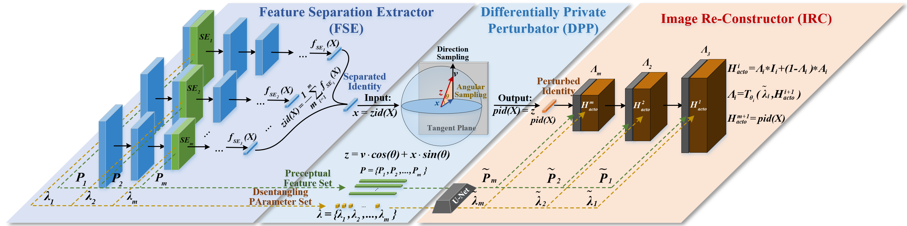
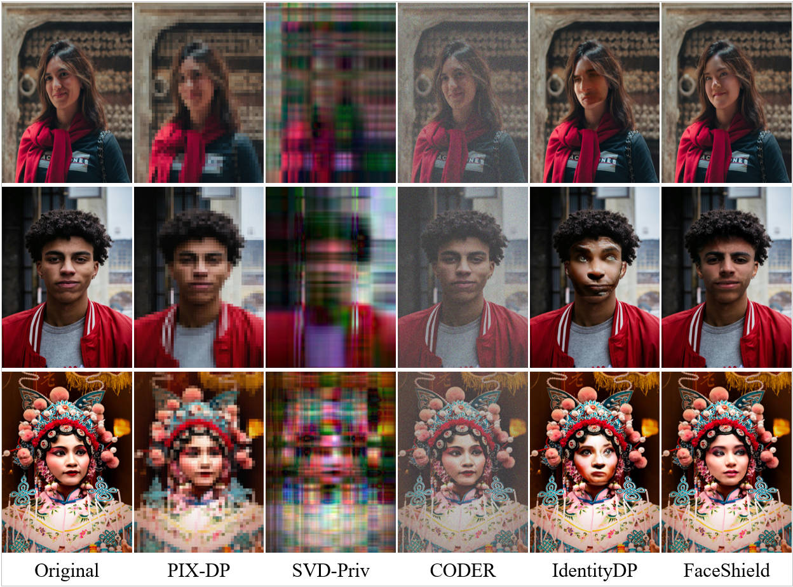

# FaceShield: High-Utility Differential Privacy Facial Protection for Online Image Publishing

[](https://creativecommons.org/licenses/by-nc/4.0/)  

<b> Authors: Ming Zhang, Yuchen Hui, <a href='https://scholar.google.com/citations?hl=zh-CN&user=y52WOmkAAAAJ&view_op=list_works&sortby=pubdate'>Xiaoguang Li*</a>, Guojia Yu, <a href='https://scholar.google.com/citations?hl=zh-CN&user=FFX0Mj4AAAAJ'>Haonan Yan</a>, <a href='https://scholar.google.com/citations?hl=zh-CN&user=oEcRS84AAAAJ&view_op=list_works&sortby=pubdate'>Hui Li*</a>  </b>

---
## 📚 **Overview**
<div align="center"> 
</div>
<div style="text-align:center;">
  
</div>

Welcome to FaceShield, your high-fidelity and provable facial privacy protection platform! Here are some key features of our platform:

> 📌 **Feature disentanglement**: *FaceShield* leverages joint statistical and spatial independence constraints to maximally disentangle facial identity and perceptual content, thereby separating identity perturbation from perceptual preservation.
> 
> 📌 **Practical Sampling**: *FaceShield* decomposes high-dimensional identity perturbation into two tractable sub-processes, thereby reducing computational overhead in high-dimensional scenarios.
> 
> 📌 **Comprehensive Protection**: *FaceShield* prevents unintended identity leakage arising from the perceptual latent space, offering users comprehensive facial privacy protection.
> 
> 📌 **Extensive Evaluation**: *FaceShield* offers users a superior and reliable solution in terms of naturalness, perceptual fidelity, privacy protection, and efficiency.

---

## 😊 **FaceShield Updates**
> - [ ] To be supplemented code after acceptance...
>
> - [x] 20/09/2025: *First version pre-released for this open source code.* 
---

<font size=4><b> Table of Contents </b></font>

- [Quick Start](#-quick-start)
  - [Environmental](#1-Environmental)
  - [Download Data](#2-download-data)
  - [Preprocessing](#3-preprocessing)
  - [Training](#4-Training)
  - [Evaluation](#5-evaluation)
- [Results](#-results)
- [Citation](#-citation)
- [Copyright](#%EF%B8%8F-license)

---

## ⏳ Quick Start

### 1. Environmental
<a href="#top">[Back to top]</a>

You can run the following script to configure the necessary environment:

```
git clone git@github.com:huiyuchen708/FaceShield.git
cd FaceShield
conda create -n FaceShield python=3.10.16
conda activate FaceShield
pip install -r requirements.txt
```

### 2. Download Data
<a href="#top">[Back to top]</a>

🛡️ **Copyright of the above datasets belongs to their original providers.**

1. Downloading [FF-HQ](https://huggingface.co/datasets/student/FFHQ) *Original* dataset for training data preparation. and [VGGface2](https://github.com/NNNNAI/VGGFace2-HQ) dataset to evaluate the published baseline. Here, we present the preprocessing results for the aforementioned datasets. Specifically, the facial images underwent re-indexing to ensure clearer identification during both the training and testing phases.[Baidu, Password: ogjn](https://pan.baidu.com/s/1NAMUHcZvsIm7l6hMHeEQjQ?pwd=ogjn), [Google Drive](https://drive.google.com/drive/folders/1N4X3rvx9IhmkEZK-KIk4OxBrQb9BRUcs?usp=drive_link)

2. Upon downloading the datasets, please ensure to store them in the [`./content`](./content/) folder, arranging them in accordance with the directory structure outlined below:

```
content
├── FF-HQ
|   ├── id* (if you download my processed data)
|   |   ├── *.png
├── VGGface2
|   ├── id* (if you download my processed data)
|   |   ├── *.jpg
Other datasets are similar to the above structure
```

If you choose to store your datasets in a different folder, you may specified the `data_root` in `train_Reconstructor.py` and `train_SeparationExtractor.py`.

### 3. Preprocessing

<a href="#top">[Back to top]</a>

To select active neurons during the training process and normalize the output of each separation layer, please follow the steps below:

1. Navigate to the preprocess directory and modify the `--data_root` parameter in the `generate.py` to point to the actual path where the dataset is stored.

2. Execute the `generate.py` script within the virtual environment FaceShield.

3. The output weight information will be saved to the `...\FaceShield\modules\weights128` directory.

```
cd preprocess
python generate.py --data_root your_dataset_path --batch_size 32
```

### 4. Training
FaceShield follows a two-stage separate training process, first training the Feature Separation Extractor (FSE) and then the Image Reconstructor (IRC).

To begin training FSE, use the following command:

```
CUDA_VISIBLE_DEVICES=X,Y NPROC_PER_NODE=2 MASTER_PORT=29505 bash train.sh --epochs 10
```

Replace X and Y with the respective GPU IDs. The log information will be output to the current directory. During training, a checkpoint will be saved every 2000 batches, and the checkpoint weights will be stored in the `checkpoints_FSE` directory. Note that the batch size for FSE training is set to 2, requiring approximately 60GB of GPU memory. You can increase the number of GPUs to speed up FSE training.

Once FSE has converged, you should comment out the stage-I training command in train.sh, and uncomment the stage-II training command. Additionally, modify the checkpoint parameter in the train_Reconstructor.py script to point to the converged FSE weights. Finally, execute the following command to start training IRC:

```
CUDA_VISIBLE_DEVICES=X,Y NPROC_PER_NODE=2 MASTER_PORT=29505 bash train.sh --epochs 20
```

During training, a checkpoint will be saved every 500 batches, and the final converged IRC weights can be found in the `checkpoints_IRC` directory.

### 5. Evaluation
If you only want to evaluate the FaceShield, you can use the the [`test.py`](./test.py) code for evaluation. Here is an example:

```
python .\test.py \
-img ./Original/img1.jpg \
-e 0.1 \
--seed 42 \
-save ./Perturbed 
```

**Please Note that before evaluation**, you need to download the publicly available pretrained weights from the provided [`link`](https://github.com/SCLBD/DeepfakeBench/releases/tag/v1.0.1)(Including FSE, IRC and encoder trained with bone intervention) and ensure that these weights are placed in the corresponding location within the weights directory.

## 🏆 Results

<a href="#top">[Back to top]</a>

We present partial experimental results for FaceShield. For a comprehensive understanding of FaceShield's performance in terms of perceptual fidelity, facial privacy protection, and sampling efficiency, we strongly recommend referring to our [paper](xxx).

<div align="center"> 
</div>
<div style="text-align:center;">
  
</div>

These resources provide a detailed analysis of the training outcomes and offer a deeper understanding of the methodology and findings.

## 📝 Citation

<a href="#top">[Back to top]</a>

If you find our benchmark useful to your research, please cite it as follows:

```
@inproceedings{？,
 author = {Zhang, Ming and Hui, Yuchen and Li, Xiaoguang and Guo, Jiayu and Yan, Haonan and Li, Hui},
 booktitle = {xxx},
 title = {FaceShield: High-Utility Differential Privacy Facial Protection for Online Image Publishing},
 url = {xxx.pdf},
 volume = {xx},
 year = {2025, xx x}
}
```

## 🛡️ License

<a href="#top">[Back to top]</a>

This repository is licensed by [The Chinese University of Hong Kong, Shenzhen](https://www.cuhk.edu.cn/en) under Creative Commons Attribution-NonCommercial 4.0 International Public License (identified as [CC BY-NC-4.0 in SPDX](https://spdx.org/licenses/)). More details about the license could be found in [LICENSE](./LICENSE).

This project is built by the Secure Computing Lab of Big Data (SCLBD) at The School of Data Science (SDS) of The Chinese University of Hong Kong, Shenzhen, directed by Professor [Baoyuan Wu](https://sites.google.com/site/baoyuanwu2015/home). SCLBD focuses on the research of trustworthy AI, including backdoor learning, adversarial examples, federated learning, fairness, etc.

If you have any suggestions, comments, or wish to contribute code or propose methods, we warmly welcome your input. Please contact us at wubaoyuan@cuhk.edu.cn or yanzhiyuan1114@gmail.com. We look forward to collaborating with you in pushing the boundaries of facial privacy protection.

